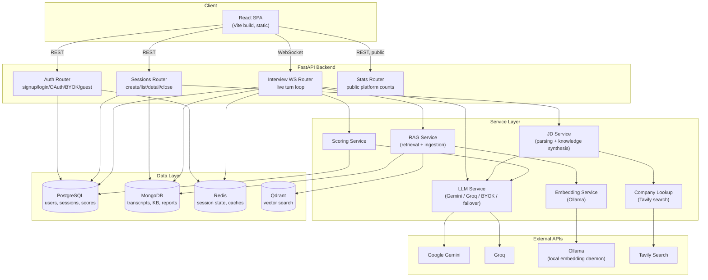
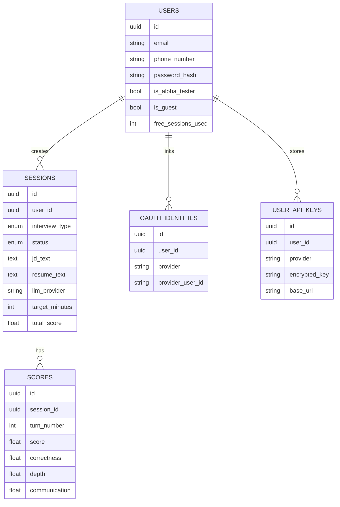
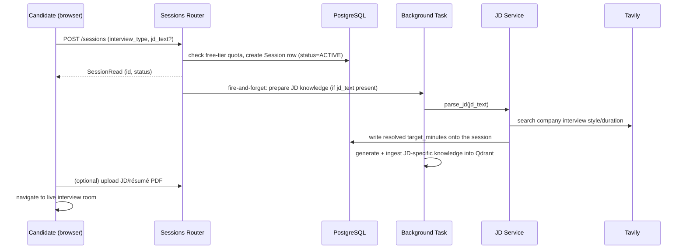
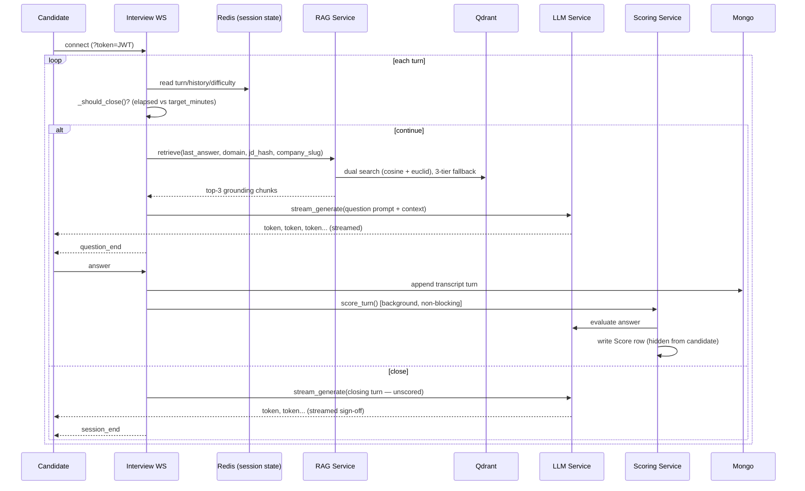

# High-Level Design

## 1. Purpose

An adaptive AI interview simulator: a candidate has a live, streaming conversation with an AI
interviewer, grounded by a retrieval-augmented knowledge base, and receives a scored closing report.
This document describes the system's shape — components, how they talk to each other, and the
lifecycle of a session. For implementation-level detail (exact classes, migration history, every
service's design rationale), see `dependency_architecture.md` at the repo root.

## 2. System Architecture

## 3. Component Responsibilities

| Component | Responsibility |
|---|---|
| **React SPA** | Homepage, auth (password + OAuth + guest), dashboard, interview setup/live room, session reports, settings (BYOK key management). Static build — no Node runtime in production. |
| **Auth Router** | Signup/login, OAuth (Google/GitHub; Microsoft pending credentials), guest trial accounts, password management, identifier linking, BYOK key CRUD. Issues/verifies JWTs. |
| **Sessions Router** | Creates sessions (enforcing the free-tier quota), lists a user's sessions, serves session detail/report, closes sessions (natural or candidate-terminated), JD/résumé PDF upload. |
| **Interview WS Router** | The live interview loop: streams questions turn-by-turn over WebSocket, receives answers, decides when to close (adaptive length), triggers per-turn scoring as a background task. |
| **Stats Router** | Public, unauthenticated platform-wide counts for the homepage. |
| **LLM Service** | Abstracts away *which* LLM actually answers — app-default (Gemini, with two-key failover) or Groq, or a user's own BYOK key/provider. Every call site (question generation, scoring, closing report, JD parsing) goes through the same `generate()`/`stream_generate()` interface regardless of provider. |
| **RAG Service** | Retrieves grounding context for the interviewer's next question from Qdrant, in three tiers — exact job-description match, pre-generated company match, static knowledge base fallback — and separately handles ingesting new content into Qdrant. |
| **JD Service** | Parses a submitted job description into structured fields, synthesizes role-specific interview knowledge, and resolves a realistic target interview duration (JD-stated → web-researched → default). |
| **Scoring Service** | Evaluates a candidate's answer against the question, producing a structured score (correctness/depth/communication) — written silently, never shown mid-interview. |
| **Embedding Service** | Turns text into vectors for RAG (currently Ollama-only — see §7, Known Gaps). |
| **Company Lookup** | Real web search (Tavily) for a named company's actual interview style and typical duration, used to make JD-driven sessions and duration estimates more realistic than guesswork. |

## 4. Data Model (relational core)

Unstructured/document-shaped data (full transcripts, the knowledge base, persisted closing reports)
lives in MongoDB instead — deliberately not modeled relationally, since its shape varies and doesn't
need joins.

## 5. Request Flow: Starting a Session

Session creation returns immediately; JD parsing and knowledge generation happen in the background
so the candidate isn't stuck waiting on a Tavily search + LLM call before they can even see the
interview room.

## 6. Request Flow: A Live Interview Turn

Scoring runs as a detached background task so it never delays the next question — the candidate
never sees scores mid-interview, only in the final report.

## 7. Cross-Cutting Design Points

- **Auth**: JWT (HS256), issued on signup/login/OAuth-callback/guest-creation. WebSocket auth uses a
  `?token=` query param (browsers can't set custom headers on a WS handshake), verified after
  `accept()`.
- **BYOK**: a session's `llm_provider` field (nullable) decides whether it uses the app-default key
  or a user's own encrypted (Fernet) key. Resolution happens once per session and is reused for every
  turn, scoring call, and the closing report — a session can't change providers mid-interview.
  Guests and free-tier users are capped on app-default usage (1 / 2 sessions respectively); BYOK and
  alpha-tester sessions bypass that cap entirely.
- **RAG fallback tiers**: exact job-description match → pre-generated company match (11 companies)
  → static knowledge base. Falls through automatically if a higher tier has no indexed content yet
  (e.g. JD-specific knowledge generation is still running in the background).
- **Adaptive interview length**: no fixed turn count. A resolved target duration (JD-stated →
  Tavily-researched → default) plus an LLM judgment call decide when to close, with a hard time-based
  safety valve and an absolute turn-count circuit breaker as last resorts. Every interview ends with a
  real, in-character closing turn — never an abrupt cutoff.
- **Session termination**: a candidate can end early via Terminate — closes the WebSocket, finalizes
  with whatever was scored so far, lands on `ABANDONED` (distinct from a natural `COMPLETED` close).
  Not resumable either way.

## 8. Known Architecture Gaps (as of this writing)

- **Embeddings have no cloud-hosted fallback.** RAG retrieval hard-depends on a locally-running
  Ollama daemon (`nomic-embed-text`). It fails gracefully (empty context, not a crash) if Ollama is
  unreachable — but that means RAG silently stops grounding questions rather than erroring loudly.
  Not yet resolved for a deployed environment.
- **Not yet deployed.** Feature-complete for a first release; deployment platform/topology is still
  being decided.
- **Guest accounts are a browser-token identity only** — not abuse-hardened. Accepted trade-off at
  this stage, not an oversight.

See `dependency_architecture.md` for the full, continuously-updated technical reference, and the
project's internal TODO for the current prioritized list of what's actually blocking deployment.
